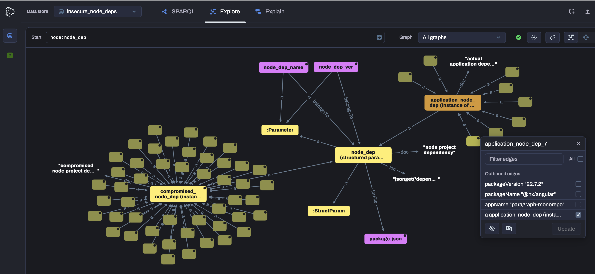
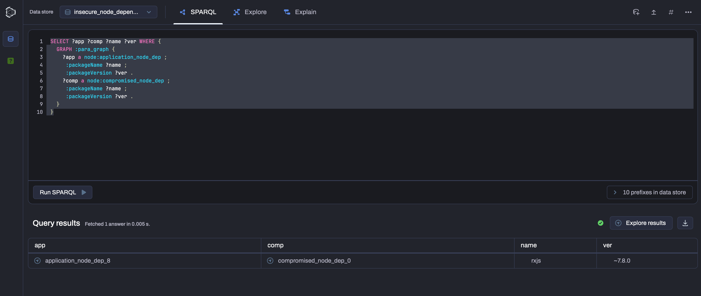
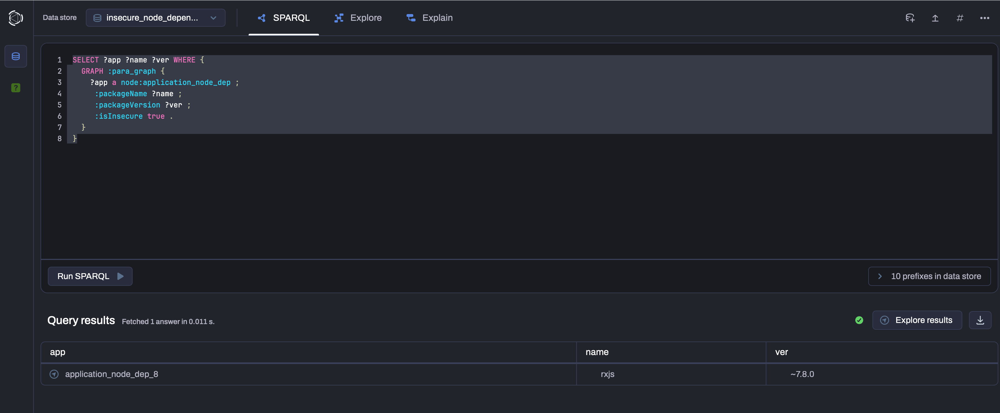
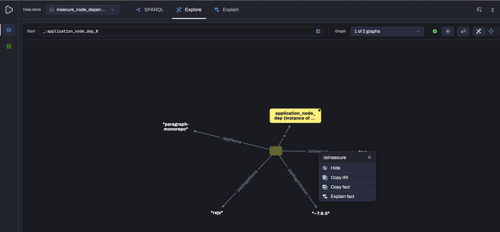
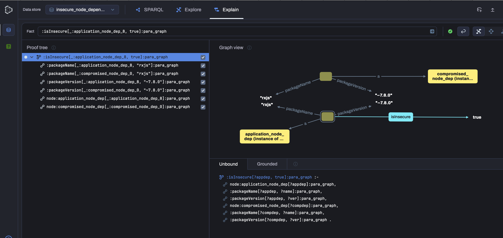

* Software Configuration Management with Prolog / Datalog
** Subtitle: a cookbook for solving real life scenarios
** Introduction - Reflective systems and devops

The impact of using wrongly(1) configured software products nowadays cannot be underestimated.

Software artifacts rely heavily on some -usually scattered- collection of parameters to define (refine) the
 aspects, variations and boundaries of their execution realm:
 - resources they use
 - strategies they adopt
 - logs they produce etc

Furthermore such parameters are interdependent and conceptually form a logical network which is to be
 well understood by humans (cognition), and which is most of the time specific to each project or system.

From a 30-year experience working on IT projects I can testify that we software engineers oftentimes
lack the very tools helping us evaluate the impact made by software configuration changes (what-if scenario) 
before we run them. Our software artifacts simply lack this "reflective"(2) capability.

This situation is normally mitigated by devops by using continuous integration, however the number of possible
combinations that can be covered under test by organizations remains usually limited. 

Correct software configuration cannot usually be captured, although this is in the present days adressed by 
container technology such as docker.

No matter what mitigation measures are taken, we run the risk to run an incorrect system as we deploy the 
software products into production environments, due to slight variations on the target system properties.

This book attempts to give solutions to practitioners such as software developers and devops engineers:
 - for building systems which can be easily reasoned about and compared
 - for integration of such reflective capabilities into bigger frameworks
and advocates the use of logical programming (using Prolog and Datalog) for this purpose.

*** notes
 (1) either incorrect, overly complex or obfuscated
 (2) the capability to reason about oneself
 
** Driving directions in the development of "paragraph"

Paragraph is a prolog software component that aims at capturing the structure of the logical network made
up from software configuration parameters. Once this configuration is defined, an analysis on a deployed
system of software products can be conducted, be it on a development machine or a deployed environment.

The main aspects of this tool is:
- its availability as a module that can be extended using prolog itself or python (via the Janus interface)
- its simple configuration which resides into a unique paragraph.yml file
- its choice of using commands or REPL, in order to ease its integration into any bigger devops framework

Sections of this book will work as a driver for the development of further features of this toolkit.

** Describing application parameters and how to access them

Application parameters can be described in the *paragraph.yml* file.
Examples below represent small sections inside it, and not the entire file.

The configuration of software products is usually performed inside files which may or may not reside into
software packages. Paragraph refers to either files or archives (zip or jar files) as "containers".

Top level containers for an application can be described as follows:

#+begin_src yaml
  deployment:
    paragraph:
      paragraph-ui:
        files:
          - help_md: file
          - pom_xml: file
        archives:
          - paragraph-ui(-version).war: archive
#+end_src

In that example paragraph-ui is an application, which is packaged as a web archive (extension .war).

That application in development has also the following top level containers: help_md and pom_xml.

These are references to the "file" section of paragraph.yml: 

#+begin_src yaml
  graph:
    file:
      help_md:
        loc: applfile("HELP.md")
        doc: "Help resources"
        params:
          - help_url: param
#+end_src

Finally help_md contains this parameter: help_url, which is a reference to the "param" section of
paragraph.yml:

#+begin_src yaml
  param:
    help_url:
        loc: regexp("[(](?<V1L>.*)[)]$")
        doc: "help resource url"
#+end_src

The help_url parameter defines a loc property using this prolog term: regexp(<regular expression>).

"loc" terms give a method to "compute" the value of the declared object:
  - for a "param", how to extract its value as text 
  - for a "file", how to locate it, given some additional constraints which we will discuss below

The navigation path for help_url is as follows:

#+begin_src prolog
?- navigate_graph_up(help_url, App, Path).
App = 'paragraph-ui',
Path = [regexp("[(](?<V1L>.*)[)]$"), applfile("HELP.md")].
#+end_src

and its value can be extracted as follows:

#+begin_src prolog
?- Opts = [ag('paragraph'), ve(''), ad(paragraph_ui)].
Opts = [ag(paragraph), ve(''), ad(paragraph_ui)].

?- paramv(help_url, Val, $Opts, _).
Trying app directory = /opt/paragraph/ParagraphUI
Val = "https://maven.apache.org/guides/index.html"
#+end_src

The explanation for the $Opts is done in the next section.

** Contraining the search for parameters - an overview

Application containers are not given a fix location (e.g. directory path or url) when declared in
*paragraph.yaml*.

To extract values of parameters Paragraph needs to have some "scope" constraining how a search is to
be performed: 
 - for which application group or application
 - or for which application version ('' means no version)
 - or under which root directory or url, using some application directory/url aliases
 etc...

This scope will determine which application archives or files will get scanned for value extraction.

In the absence of "application scope" the search will generate all possible matching applications, given the 
minimum information where to start the search from (root directory or base url).

** Internal programming model based on graph search and predicate chaining
As discussed above, paragraph resolves all possible navigation paths (bottom-up) from a parameter to an 
application, as in the following examples:

#+begin_src prolog
?- navigate_graph_up(json_ktext, 'paragraph-ui', L).
L = [jsonget('d/_/t'), endswith(".json"), warfile('paragraph-ui(-version).war')].

?- navigate_graph_up(pom_xml_version, 'paragraph-ui', L).
L = [xpath(//project/version(text)), endswith("/pom.xml"), warfile('paragraph-ui(-version).war')] ;
L = [xpath(//project/version(text)), applfile("pom.xml")].
#+end_src

define the respective paths:

#+begin_src text
json_ktext      --jsonget()--> json_config --endswith()--> <app archive> --warfile()--> paragraph-ui

pom_xml_version --xpath()-->   pom_xml     --endswith()--> <app archive> --warfile()--> paragraph-ui
pom_xml_version --xpath()-->   pom_xml     --applfile()-------------------------------> paragraph-ui
#+end_src

navigate_graph_up is a generative predicate when the application is passed as a variable ... 

#+begin_src text
?- navigate_graph_up(ts_option, App, L).
App = host,
L = [jsonget('compilerOptions/:'), applfile('tsconfig.app.json')] ;
App = queries,
L = [jsonget('compilerOptions/:'), applfile('tsconfig.app.json')] ;
App = pavements,
L = [jsonget('compilerOptions/:'), applfile('tsconfig.app.json')] ;
App = 'pavements-e2e',
L = [jsonget('compilerOptions/:'), applfile('tsconfig.json')] ;
App = 'queries-e2e'              % etc...
#+end_src

Given the high number of possible navigation paths and "loc" terms (xpath(), regexp(), jsonget() etc)
Paragraph takes the choice of implementing single graph transition predicates once,
and to use a "fold"(1) as generic mechanism to chain all applicable transitions from application to parameter
(the parameter value extraction is performed top-down) 

*** notes
(1) a technique from functional programming

* Building a complex graph model using pavements and tags
** The pavements project
This project aims at defining paragraph.yml as the composition of individual graph parts called "pavements".

Each pavement can typically describe the configuration of a single application or system.
In order to avoid duplication of definitions, a pavement itself can inherit container and parameter definitions
from templates via a set of tag, e.g.

    - Tag build=maven
    - Tag framework=springboot
      
which considerably simplifies its yaml source. These tag reference templates from the pavements library.
Template pavements from the pavements library can themselves use tags to inherit content from other templates.

The composed graph can then be described either via a DSL in a pavements.yml file, or via a set of builder
  commands.
Confer the pavements project for more details.

** Integration of the pavements' models via the paragraph_conf module
The pavements data get converted to prolog facts described in a specific language called BDSL ("Binding DSL").

#+begin_src text
+------------+     +-----------------+     +--------------+
|  pavements |---->|  paragraph_conf |<----|  paragraph   |
|    model   |     |    BDSL facts   |     |  predicates  |
+------------+     +-----------------+     +--------------+
#+end_src

*** Example of BDSL facts
Confer the bdsl.pl for some detailed examples of facts described using that language.
The prolog/bdsl_lib directory also contains working examples that can be used in daily practice.

*** BDSL design
The DSL focus is on "container" relationships, with predicates of the form:  

#+begin_src text
   container_term :> p(path_list)                  for specifying where to locate a container in the application structure
   container_term -+ param_term(param_props_list)  for specifying parameters associated to a container
#+end_src

The container term can use the _ wildcard to indicate any container matching the rest of the term.

This approach of connecting terms with operators allows to easily express relationships between containers and parameters or paths, 
   without duplication of information.

Whenever possible the DSL should allow to assert an incomplete description of the "reality":
  - incomplete terms, yet still supporting the correlation of facts e.g. 
#+begin_src text  
      f('pom.xml') is a synonym for f([name='pom.xml' | _])
#+end_src      
  - incomplete directory/archive contents with a "contains" semantic instead of a "is" semantic e.g.
#+begin_src text  
      z('app.jar', [ f('pom.xml'),
                     d('-- com/example', 
                       [ 'a.class',
                         'b.class' 
                         | _
                       ])
                   ])
#+end_src                    
  - any incomplete information can still be interpreted as "binding" fact(s) during paramv evaluations

For example d and z predicates use some partial information on where one can find some of their child resources.
The syntax is a prolog "list with indentation using -- ", which allows for a readable display of the tree structure. 

IMPORTANT. The advertised syntax is enabled via assert_bdsl's fact expansion pipeline (confer t/bdsl_expand_t.plt)

* Practical examples of searches for application parameters
** Use case driven examples of configuration parameters' searches
Big Angular applications are a challenge to comprehend as configuration is everywhere and discrepancies between
modules' configuration can go unnoticed until problems surface in the integrated product.
    - a node project dependency might not be compatible even for a minor upgrade of angular
    - a module's eslint rules might not be aligned with other modules' settings 
    - a module's typescript options might not be aligned with other modules' configuration 
Below are some example of searches which can be done using the BDsl.    

** Examples of "bridging" searches
*** Scopers to the rescue
*** Example - Chaining parameter evaluations with scopers

** Diff revisited
Diff and git diff are great tools to find out whether changes made across applications/application modules were 
 performed in a consistent manner. Most of the time the difficulty lies into the verbosity of the diff output, 
 specially when comparing modified large tree structures like Json or Xml documents, which may prevent focussing    
 on a single configuration point or easily implementing automated checks.

*** reference to the extensible Xml diff article
This topic was addressed in this blog entry: https://functionmissing.blogspot.com/2018/01/ by showing that 
diff can be performed for example on XML documents by selecting a subset of the tree, using such expressions:

#+begin_src text 
    % match branch objects, find diff on bird level
    diff(on(//branch, @height), from(//bird, @name)) 
#+end_src

*** diff DSL based on paramv
A similar solution is implemented by paragraph, using the paramv evaluation:

#+begin_src text 
    % match project node dependencies, find diff on version
    diff(on(node_dep, node_dep_name), from(node_dep_ver)) 
#+end_src

The above query will return a list of node dependencies that are matched but differ by their version.
The pattern is to match tree nodes using a structured parameter, and calculate diff on the individual parameter.

* Automatic verification of software "contracts"

** Role of ontologies
Ontologies defined using the OWL2 standard allow to reason using a more natural framework than just plain prolog:
    - generalization is made possible through the use of axioms
Confer the resources in the pgraphlog sub-project.

** Defining contracts in a datalog system

Datalog rules can infer additional facts as to whether a captured para_graph together with some 
calculated paramvs fullfill some expectations ("contracts"), for example:
    - all project maven dependencies need to be compatible with JDK 21
    - all project node dependencies must be verified against known compromised packages 
    - all project B's artifacts (e.g. jar files) must support API v2.1 from project A's API

** Example of application: insecure software dependencies for node applications

nodejs applications are managing their dependencies through the package.json file and keep track of the transitive dependencies
via the package-lock.json. Slight changes in the package.json generate big changes in the dependency tree in package-lock.json,
and it's fairly easy to loose oversight on these dependencies and inherit a whole set of new third-party artifacts.

With the advent of supply chain attacks and compromised node packages, several solutions can be choosen:
#+begin_src text 
    A - scan only the company's package repository and rely on it to ensure no compromised packages are present there 
    B - scan the already packaged applications themselves with some specialized security solution
    C - react on any package-lock change in a CI (continuous integration) pipeline and enforce an evaluation of how secure it is
#+end_src 

Most scanning solutions are done at certain intervals to ensure security compliance. If the reference list of compromised 
node packages gets updated, a full rescan of existing applications is required. So solution C is an appealing solution in that
it prevents to package an application with a compromised dependency. However if an already merged node dependency is identified
a-posteriori to be a compromised dependency, chances are that the CI pipeline will use the dependency for example when running
end to end tests. To avoid rescanning of packaged applications or rechecks of recent package-lock changes, a Datalog system can
be used to record the actual application dependencies and use inference rules to automatically flag such dependencies as insecure,
upon reference list changes.
 
This is covered in detail in the following sections, using the RDFox graph/datalog functions.

*** data modeling using BDsl and reference data into a knowledge graph db

The following graph represents 2 sub-graphs connected via the "node_dep" StructParam:

#+begin_src text 
    - nodes connected to the "compromised_node_dep" represent the reference list obtained from a csv file (safedep.io)
    - nodes connected to the "application_node_dep" represent the paramv values of "node_dep" for a given application
    - other nodes stem from the nodeproj BDsl converted to RDF (nodeproj_bdsl.ttl) 
#+end_src 

Confer resources available in the "pgraphlog" directory.

*** performing queries

The following section gives simple examples of SPARQL queries. 

Searching for application dependencies:

#+begin_src text 
SELECT ?app ?name ?ver WHERE {
  GRAPH :para_graph {
    ?app a node:application_node_dep ;
     :packageName ?name ;
     :packageVersion ?ver .
  }
}
#+end_src 

Joining application dependencies with matching compromised node packages:

#+begin_src text 
SELECT ?app ?comp ?name ?ver WHERE {
  GRAPH :para_graph {
    ?app a node:application_node_dep ;
     :packageName ?name ;
     :packageVersion ?ver .  
    ?comp a node:compromised_node_dep ;
     :packageName ?name ;
     :packageVersion ?ver .
  }
}
#+end_src 

As simulation the rxjs dependency has been added as record "0" in the compromised-node-deps.ttl:

*** automatically checking "contracts" fullfilment with the help of datalog rules

Automated inference of new facts such as "this dependency is insecure" can be implemented through such a 
datalog rule (the syntax is using the named graph :para_graph):

#+begin_src text
[?appdep, :isInsecure, true] :para_graph :-
    [?appdep, a, node:application_node_dep] :para_graph,
    [?appdep, :packageName, ?name] :para_graph,
    [?appdep, :packageVersion, ?ver] :para_graph,
    [?compdep, a, node:compromised_node_dep] :para_graph,
    [?compdep, :packageName, ?name] :para_graph,
    [?compdep, :packageVersion, ?ver] :para_graph. 
#+end_src

and queried very easily using:

#+begin_src text
SELECT ?app ?name ?ver WHERE {
  GRAPH :para_graph {
    ?app a node:application_node_dep ;
     :packageName ?name ;
     :packageVersion ?ver ;
     :isInsecure true .
  }
}
#+end_src

which yields the same result as in the above section, but does not requires a complex graph traversal:

*** explaining "broken contracts" - "explainable AI" logically and graphically

Explanation as to why a contract is not fulfilled is an important function that the Datalog system should support,
 to assist the decision making process for all involved stakeholders (technical and legal).

Carrying on the previous example where an insecure node dependency has been identified, the user can right click
on the newly created "isInsecure" fact and obtain a menu which includes the "explain fact" option.

By selecting individual clauses of the datalog rule step by step, the user gets a completed graph representation where
 the matching elements can be displayed side by side. 

In the case of the insecure node dependencies, that the packageName and packageVersion found in the application node_dep
 match those of a compromised node dependency from the reference list. 

 

* Examples of workflows - coordinating complex search tasks
** The coworkers module - resumable workflow system
** Use of datalog system and agentic AI
